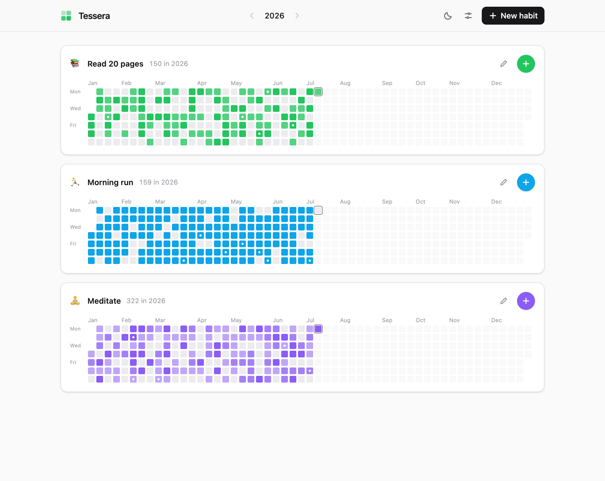

<div align="center">

# Tessera

**A quiet, local-first habit tracker.**
One GitHub-style heatmap per habit, a journal note for any day,
and your data never leaves your browser.

[](https://github.com/mikha08-rgb/Tracker/actions/workflows/ci.yml)

**[Try it live →](https://mikha08-rgb.github.io/Tracker/)**
It's the real app, not a demo build — anything you log stays in your own browser.

</div>

<picture>
  <source media="(prefers-color-scheme: dark)" srcset="docs/screenshot-dark.png" />
  
</picture>

Every day is a _tessera_ — a single tile in a mosaic. Log a habit each day and watch the year
come together, one small square at a time.

## Why Tessera

- **Local-first, private by construction.** Everything lives in your browser's IndexedDB. No
  account, no server, no analytics, no network requests at all. Free forever because there is
  nothing to pay for.
- **GitHub-style heatmaps.** Log a count per day (one tap for today). Cells shade with
  intensity — auto-scaled to your own history, or toward a daily target you set per habit.
- **A journal, not just checkmarks.** Attach a note to any day, including days you _didn't_ do
  the habit ("was sick"). Days with notes get a small dot.
- **No streaks.** No guilt mechanics, no points, no badges. Just an honest picture of what you
  actually did.
- **Installable PWA.** Works fully offline; add it to your phone's home screen or dock and it
  behaves like a native app.
- **Portable data.** One-click export to a human-readable, versioned JSON file — and an import
  that validates everything before touching your data.

## Using Tessera

- **Log today** with the big colored **+** on each habit card — it becomes a check (or your
  count) once you've logged, and tapping again adds another.
- **Any other day**: click its cell — a popover lets you adjust the count and write a note.
- **Keyboard**: `Tab` to today's cell, arrow keys to move between days, `Enter` to open.
- **Years**: switch with the ‹ › arrows in the header.
- **Back up** from Settings → Export. The file is plain JSON; keep it wherever you like.

> [!TIP]
> **On iOS, install the app** (Share → Add to Home Screen). Safari deletes site data — including
> IndexedDB — for websites you haven't visited in 7 days, but installed web apps are exempt.
> Export a backup now and then regardless; that's what it's for.

## Self-hosting & development

Tessera is a static site — any file server can host it.

```bash
npm install
npm run dev        # dev server (service worker disabled in dev)
npm run check      # typecheck + lint + format check + tests
npm run build      # production build in dist/
npm run preview    # serve the build (use this to test PWA/offline behavior)
```

Requires Node 22+. The [live instance](https://mikha08-rgb.github.io/Tracker/) deploys via
[`.github/workflows/deploy.yml`](.github/workflows/deploy.yml) — forks get the same setup by
enabling Pages → GitHub Actions in the repo settings and running the workflow.

Contributions welcome — see [CONTRIBUTING.md](CONTRIBUTING.md).

## Data format

Backups are versioned JSON (`schemaVersion`), so future versions can migrate old files:

```jsonc
{
  "app": "tessera",
  "schemaVersion": 1,
  "exportedAt": "2026-07-06T18:02:11.123Z",
  "settings": { "weekStart": "mon", "theme": "dark" },
  "habits": [
    {
      "id": "…",
      "name": "Read",
      "emoji": "📚",
      "color": "#22c55e",
      "targetPerDay": null,
      "…": "…",
    },
  ],
  "entries": [{ "habitId": "…", "date": "2026-07-06", "count": 2, "note": "chapter four" }],
}
```

Dates are **local calendar dates** — a habit logged at 11 pm counts for that day, whatever your
timezone (the test suite runs in three timezones in CI to keep it that way). If you travel, a
day logged in Tokyo stays on that Tokyo date; Tessera never re-maps history.

## License

[MIT](LICENSE)
